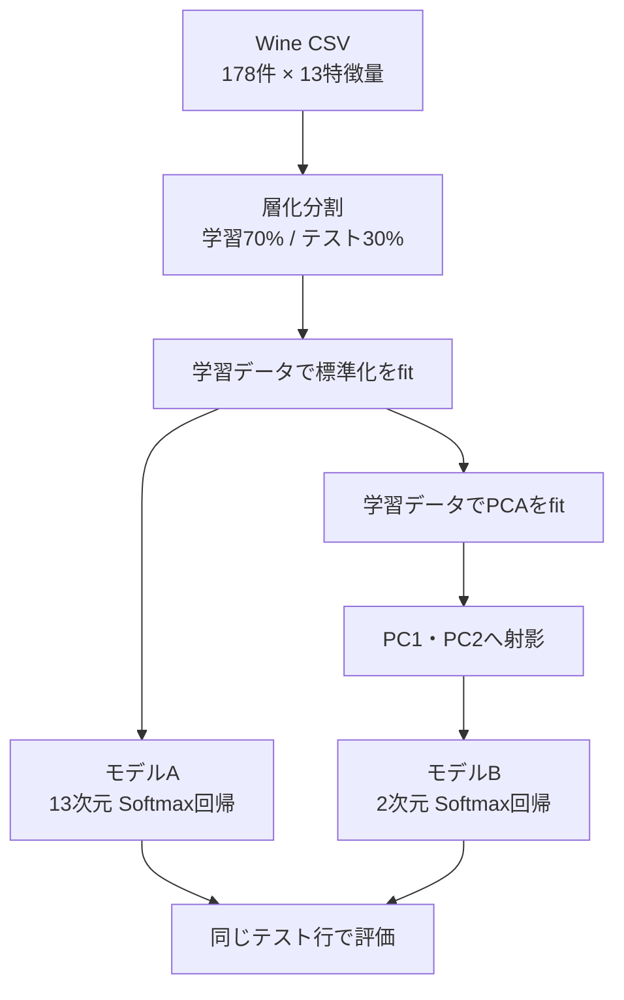

# ML Visual Lab：PCA次元圧縮・ロジスティック回帰比較 実装設計書

対象リポジトリ：[SioComb/ml-visual-lab](https://github.com/SioComb/ml-visual-lab)  
実装対象：Wineデータを用いたPCAアニメーションと分類精度比較

---

## 1. Codexへの実装指示

この設計書に従い、既存サイトへ「次元圧縮」タブを追加してください。

- 既存の回帰・分類・クラスタリング・強化学習・Association・NLPを壊さない
- HTML／CSS／ES Modulesのブラウザ完結構成を維持し、依存パッケージを追加しない
- 精度・寄与率は固定値にせず、`wine.csv` から実際に計算する
- 標準化・PCA・モデル学習は学習データだけでfitし、データリークを防ぐ
- 新規ブランチで実装し、`npm run check` と `npm test` を通す
- 既存テストを削除したり期待値を緩めたりしない

### 用語

画面上の正式名称は「PCA＋ロジスティック回帰」とする。

PCR（Principal Component Regression）は、PCA後の主成分を使って連続値を予測する線形回帰である。Wineデータは3クラス分類なので、厳密にはPCRではない。画面に次の注記を表示する。

> 今回は分類問題のため、PCRではなく「PCA＋ロジスティック回帰」を使用します。

---

## 2. 目的と比較条件

13個の特徴量が、PCAによりPC1・PC2へ変換される過程をアニメーションで見せる。同じ学習・テスト行を使って次を比較する。

| モデル | 入力 | 分類器 |
|---|---|---|
| A：圧縮なし | 標準化した全13特徴量 | 3クラスSoftmax回帰 |
| B：PCAあり | PC1・PC2 | 3クラスSoftmax回帰 |

参考値（標準化、層化分割、テスト30%、seed 42）：

| 指標 | 目安 |
|---|---:|
| 全13特徴量モデル | 約98.1% |
| PCA 2次元モデル | 約94.4% |
| PC1＋PC2累積寄与率 | 約54.9% |

参考値は画面へハードコードしない。実装したアルゴリズムの結果を表示し、方式差による数ポイントの違いは許容する。

---

## 3. 既存構成に合わせた統合方針

現行リポジトリは `dist/index.html` を入口とする静的ES Modules構成。NLPやAssociationと同様、独立ラボとして実装する。

現行の `dist/ml.js` は分類時に2特徴量しか扱わず、ロジスティック回帰も2クラス専用である。Wineデータは13特徴量・3クラスなので、既存 `trainModel()` を改造しない。`dist/pca/` に専用処理を閉じ込め、既存機能への回帰リスクを避ける。

### 新規ファイル

```text
dist/
├─ pca.html
└─ pca/
   ├─ csv/wine.csv
   ├─ data.js
   ├─ math.js
   ├─ ui.js
   └─ style.css

tests/
├─ pca.test.js
└─ pca-browser.mjs  # 任意
```

### 変更ファイル

- `dist/index.html`
- `dist/app.js`
- `README.md`

### 責務

| ファイル | 責務 |
|---|---|
| `data.js` | CSV読込、形式検証、数値変換、表示名 |
| `math.js` | 層化分割、標準化、PCA、Softmax回帰、評価 |
| `ui.js` | DOM生成、状態管理、SVG描画、アニメーション |
| `style.css` | `.pca-` 名前空間の専用CSS |
| `pca.html` | `./#pca` へのリダイレクト |
| `pca.test.js` | 数学処理・データリーク防止の単体テスト |

178行×13特徴量なら処理量は小さい。初期実装ではWorkerを追加しない。実測で学習が100msを大きく超えて操作を妨げる場合だけWorker化する。

---

## 4. ナビゲーション変更

### `dist/index.html`

タスク切替の「クラスタリング」と「強化学習」の間へ追加：

```html
<button id="pcaTask" type="button" aria-pressed="false">
  <span>📉</span> 次元圧縮 <small>PCA</small>
</button>
```

独立ラボ用sectionへ追加：

```html
<section
  id="pca"
  class="pca-page"
  hidden
  aria-label="次元圧縮 / PCA"
></section>
```

headへ追加：

```html
<link rel="stylesheet" href="./pca/style.css" />
```

### `dist/app.js`

```js
import { initPCA } from './pca/ui.js';

const viewButtons = {
  // existing...
  pca: 'pcaTask',
};

let pca = null;
```

`activateView()` へ追加：

```js
if (activeView === 'pca') pca.hide();

if (next === 'pca') {
  pca ??= initPCA();
  pca.show();
}
```

### `dist/pca.html`

既存の `association.html` と同じ互換入口にする。

```html
<script>
  location.replace('./#pca');
</script>
```

---

## 5. Wine CSV仕様

列順：

```text
alcohol,malic_acid,ash,alcalinity_of_ash,magnesium,
total_phenols,flavanoids,nonflavanoid_phenols,
proanthocyanins,color_intensity,hue,
od280/od315_of_diluted_wines,proline,target
```

検証条件：

- 見出しを除いて178件
- 13特徴量はすべて有限の数値
- `target` は0、1、2
- 各クラス3件以上
- 空欄、NaN、Infinity、列数不一致を拒否
- 読込失敗時は再試行できるエラー表示
- `new URL('./csv/wine.csv', import.meta.url)` から読む

表示名：

| CSV | 日本語 |
|---|---|
| alcohol | アルコール |
| malic_acid | リンゴ酸 |
| ash | 灰分 |
| alcalinity_of_ash | 灰分アルカリ度 |
| magnesium | マグネシウム |
| total_phenols | 総フェノール |
| flavanoids | フラボノイド |
| nonflavanoid_phenols | 非フラボノイドフェノール |
| proanthocyanins | プロアントシアニン |
| color_intensity | 色の濃さ |
| hue | 色相 |
| od280/od315_of_diluted_wines | OD280/OD315 |
| proline | プロリン |

target 0/1/2は画面上で「ワインA/B/C」と表示する。内部値は変換しない。

---

## 6. データ処理



重要：平均、標準偏差、主成分軸、モデル重みは学習データだけから求める。全件表示用の散布図にも、学習データでfitしたscalerとPCAを適用する。

### 6.1 層化分割

- test比率30%
- seed 42
- targetごとにシャッフル
- A/Bモデルで同じ行IDを共有
- `dist/ml.js` の `rng()` と同じMulberry32方式を再利用可能

推奨export：

```js
export function stratifiedSplit(records, testRatio = 0.3, seed = 42)
```

### 6.2 標準化

学習データの各列から平均・標準偏差を求める。

$$
z_{ij} = \frac{x_{ij} - \mu_j}{\sigma_j}
$$

- 分散0の列はエラー
- テストと全件表示には学習側の平均・標準偏差を適用
- 母標準偏差または標本標準偏差へ統一

```js
export function fitStandardScaler(rows)
// { mean, scale, transform(row), transformAll(rows) }
```

### 6.3 PCA

1. 標準化済み学習データから13×13共分散行列を作る
2. 対称行列の固有値・固有ベクトルをJacobi法で求める
3. 固有値を降順に並べる
4. 上位2本をPC1・PC2にする
5. 学習、テスト、全件を同じ軸へ射影する

$$
Z = X_{standardized} W_2
$$

寄与率：

$$
r_k = \frac{\lambda_k}{\sum_j \lambda_j}
$$

各固有ベクトルは、絶対値最大の要素が正になるよう符号をそろえる。符号反転は数学的に同じだが、描画とテストを決定的にするため必要。

```js
export function fitPCA(standardizedTrain, components = 2)
// { eigenvalues, components, explainedVarianceRatio, transform, transformAll }
```

### 6.4 3クラスSoftmax回帰

既存の2クラスSigmoid実装は使わない。

$$
P(y=k|x) = \frac{e^{s_k}}{\sum_c e^{s_c}}
$$

数値安定化：

```js
const max = Math.max(...scores);
const exp = scores.map(score => Math.exp(score - max));
```

推奨条件：

- バッチ勾配降下法
- 最大2,000～3,000 epoch
- 重み0で開始
- L2正則化あり。切片は正則化しない
- A/Bモデルで学習率・epoch・L2を統一
- 損失改善が止まれば早期終了可能
- NaN／Infinityを検知したらエラー

```js
export function fitSoftmaxRegression(trainX, trainY, options = {})
// { weights, intercepts, history, predict, predictProba }
```

### 6.5 評価

両モデルについて同じテスト行から計算：

- Accuracy
- 正解数／テスト件数
- 誤分類数
- 3×3混同行列

```js
export function evaluateClassification(model, testX, testY, classes)
```

---

## 7. 画面設計

既存の白・緑系デザイン、角丸、余白、カード表現を継承する。PCAラボだけ別製品のような配色へ変更しない。

```text
┌──────────────────────────────────────────────────┐
│ 13次元のワインを、2次元で見分ける                 │
│ Wine Dataset・用語注記                            │
├──────────────────────────────────────────────────┤
│ 01 13特徴量 → 02 標準化 → 03 PCA → 04 分類        │
├─────────────────────┬────────────────────────────┤
│ 圧縮アニメーション  │ PC1×PC2散布図              │
│ 13本の特徴量バー    │ A/B/C、分類領域、誤分類     │
│        ↓             │                            │
│ PC1・PC2             │                            │
├─────────────────────┴────────────────────────────┤
│ 全13特徴量モデル VS PCA 2次元モデル               │
│ Accuracy・誤分類数・差・累積寄与率                 │
└──────────────────────────────────────────────────┘
```

### ヘッダー

- 見出し：`13次元のワインを、2次元で見分ける`
- 説明：`PCAで情報を圧縮したあと、ロジスティック回帰で3種類のワインを分類します。`
- バッジ：`Wine Dataset · 178 samples`
- PCRとの用語注記

### パイプライン表示

1. 13特徴量
2. 標準化
3. PC1・PC2
4. ロジスティック回帰

アニメーション進行に合わせ、現在工程を強調する。

---

## 8. PCAアニメーション

3クラスから代表行を固定で1件ずつ選択できる。

- ワインA
- ワインB
- ワインC

左側に13本の標準化済み特徴量バーを表示する。

- 0を中央
- 正値は緑で右方向
- 負値は青紫で左方向
- 特徴量名と標準化値を表示
- 右側にPC1、PC2の値と個別寄与率を表示

| 進捗 | 表示 |
|---:|---|
| 0～20% | 元の13特徴量 |
| 20～45% | 平均0・分散1へそろえる標準化 |
| 45～75% | 13本が2本の主成分へ集約 |
| 75～100% | PC1・PC2を確定し、散布図の対応点を強調 |

操作：

- 圧縮を再生
- 一時停止／再開
- リセット
- 0～100%進捗スライダー
- サンプル切替時は0へ戻す

実装条件：

- `requestAnimationFrame()` を使う
- 毎フレームDOMを再生成しない
- CSS transform、opacity、SVG属性を更新
- 約2.0～2.5秒
- `hide()` で再生停止
- `prefers-reduced-motion: reduce` では自動再生せず、スライダーで確認可能にする

---

## 9. PCA散布図

SVGで描画する。

- X軸：第1主成分
- Y軸：第2主成分
- 3クラスを既存 `classPalette` と調和する色で表示
- 学習点は塗りつぶし
- テスト点は白抜き
- 各点の `<title>` に行ID、正解、予測を設定
- 軸付近にPC1、PC2の寄与率
- PCA後Softmax回帰の分類領域を淡い背景色で表示
- 誤分類テスト点に外周リング

分類領域はSVGを40×30程度のグリッドに分け、各セル中心をモデルBで予測して着色する。Canvasは導入せず、既存サイトと同じSVG中心の描画にそろえる。

---

## 10. 精度比較

モデルA/Bを横並び表示する。

```text
全13特徴量＋Softmax回帰
Accuracy 98.1%
正解 53 / 54

PCA 2次元＋Softmax回帰
Accuracy 94.4%
正解 51 / 54
```

数値は表示例であり、実計算結果を使う。

自動解説：

- A > B：`圧縮前のほうが高精度です。分類に役立つ情報の一部が失われました。`
- A = B：`2次元へ圧縮しても、今回の分割では精度を維持できました。`
- A < B：`今回の分割ではPCA後のほうが高精度です。不要な変動が減った可能性があります。`

「必ず全特徴量のほうが高精度」と断定しない。PCAは正解ラベルを使わず分散を保つため、結果はデータと分割に依存する。

下部に次を表示：

1. PCAは正解ラベルを見ず、ばらつきが大きい方向を探す
2. PC1・PC2は元特徴量の重み付き合成
3. 次元削減は可視化と計算量削減に有利
4. 分類に役立つ情報を落とす可能性がある
5. 寄与率と分類精度は同じ指標ではない

---

## 11. UI状態管理

`initPCA()` 内で保持：

```js
{
  initialized: false,
  loading: false,
  result: null,
  selectedSample: 0,
  animationProgress: 0,
  playing: false,
  animationFrameId: null
}
```

公開API：

```js
return {
  show(),
  hide()
};
```

- `show()`：rootを表示。初回だけCSV読込・計算・描画
- `hide()`：rootを非表示。アニメーション停止。計算結果は保持
- 再表示時にCSVを再取得・再学習しない

状態表示：

| 状態 | 文言 |
|---|---|
| 読込中 | Wineデータを読み込んでいます… |
| 計算中 | 標準化・PCA・分類モデルを計算しています… |
| 完了 | 178件を13次元から2次元へ圧縮しました。 |
| 失敗 | 計算を完了できませんでした。データ形式を確認してください。 |

エラー時は「再読み込み」ボタンを出す。生の例外やスタックトレースは画面へ出さず、`console.error()` に残す。

---

## 12. CSS・レスポンシブ・アクセシビリティ

- 既存CSS変数を優先利用
- PCA固有クラスは `.pca-` で始める
- 既存 `.workspace`、`.settings`、`.panel`、`.metrics`、`.metric`、`.primary`、`.quiet` を再利用
- 本文16px、操作ラベル14px以上、補足12px以上
- 760px以下はアニメーションと散布図を縦積み
- 390pxでも主要操作が欠けない
- タブへ `aria-pressed`
- 状態へ `role="status" aria-live="polite"`
- SVGへ具体的な `aria-label`
- 色だけでクラスを区別せずA/B/C表記と凡例を併用
- 誤分類は色＋外周リング
- キーボードだけで操作可能
- 200%拡大で意図しない横スクロールを出さない

---

## 13. テスト設計

`tests/pca.test.js` は `node:test` と `assert/strict` を使う。

### CSV

- 178件・13特徴量・3クラス
- 不正列数、空欄、非数値を拒否

### 分割

- seed 42で決定的
- train/testに行ID重複なし
- 全178件がどちらかに入る
- 3クラスすべてが両方に存在
- A/Bモデルが同じ分割を共有

### 標準化

- train各列の平均がおおむね0
- train各列の標準偏差がおおむね1
- test変換にtrainの統計量を使用
- test値を変更してもscalerが変化しない

### PCA

- 固有値が降順
- PC1とPC2が直交
- 主成分ベクトルのノルムがおおむね1
- 13次元が2次元へ変換される
- 寄与率が0～1
- Wineの累積寄与率が0.50～0.60程度
- NaN／Infinityなし

### Softmax回帰

- 3クラス確率の合計がおおむね1
- 各確率が0～1
- 最大確率クラスが予測クラス
- 学習後損失が初期損失より小さい
- NaN／Infinityなし

### 比較

- Accuracyが0～1
- 全13特徴量モデルが0.90以上
- PCA 2次元モデルが0.85以上
- 基準データ・seed 42では全13特徴量モデルがPCAモデル以上
- 誤分類数が混同行列の非対角要素合計と一致

浮動小数点は完全一致させず、`1e-6` 程度の許容誤差を使う。

### 任意のブラウザテスト

既存 `tests/nlp-browser.mjs` の静的サーバ方式を踏襲する。

- `/#pca` でPCAタブが選択
- `#supervisedWorkspace` が非表示
- 178件表示
- 2モデルのAccuracy表示
- 再生で進捗増加
- 一時停止で停止
- サンプル変更で0へ戻る
- pageerror 0件
- 1440pxと390pxで主要操作が表示

---

## 14. 完了条件

- [ ] 「次元圧縮」タブと `/#pca` が動く
- [ ] Wine CSV 178件・13特徴量・3クラスを読む
- [ ] trainだけで標準化とPCAをfitする
- [ ] 13特徴量→PC1・PC2のアニメーションが動く
- [ ] 再生・停止・再開・リセット・進捗操作が動く
- [ ] PC1×PC2散布図、3クラス、分類領域、誤分類を表示
- [ ] 同じ分割で13次元モデルとPCAモデルを比較
- [ ] Accuracy、正解数、誤分類数、累積寄与率を実計算
- [ ] PCRとの用語差を説明
- [ ] モバイル・キーボード・reduced motion対応
- [ ] 既存機能と既存テストに回帰なし
- [ ] `npm run check` と `npm test` が成功
- [ ] READMEの機能一覧・ファイル構成を更新

---

## 15. 実装順序

1. `wine.csv` を配置
2. `data.js` とCSVテスト
3. 層化分割・標準化とテスト
4. PCA・固有値分解とテスト
5. Softmax回帰・評価とテスト
6. `ui.js` で静的画面と散布図
7. アニメーションと操作
8. `index.html`／`app.js` へ統合
9. `pca.html`、CSS、レスポンシブ
10. README更新
11. `npm run check`、`npm test`
12. 変更概要と検証結果をPR本文へ記載

---

## 16. PR本文テンプレート

```markdown
## 概要

Wineデータを使ったPCA次元圧縮ラボを追加しました。

## 追加機能

- 13特徴量からPC1・PC2への圧縮アニメーション
- PCA 2次元散布図
- 3クラスSoftmax回帰の分類領域
- 全13特徴量モデルとPCA 2次元モデルの精度比較
- 寄与率、正解数、誤分類数の表示

## 設計上の注意

- 標準化・PCA・モデル学習は学習データだけで実施
- 既存の2クラス用ロジスティック回帰は変更せず、PCAラボを独立実装
- すべてブラウザ内で計算

## 検証

- npm run check
- npm test
- #pca の表示とアニメーション操作
```

